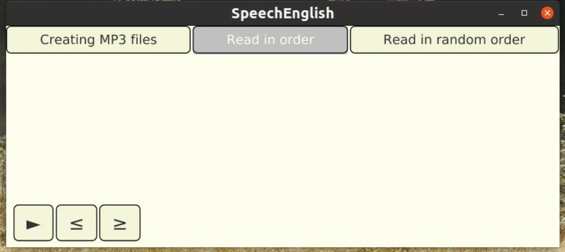
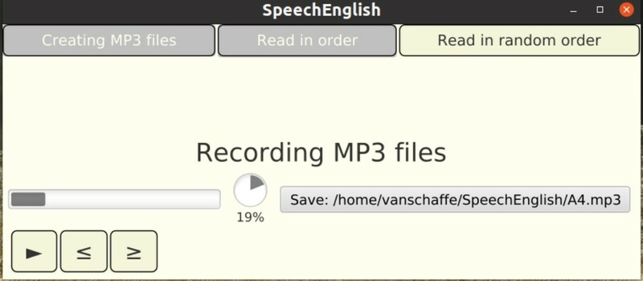

# Mediaplayer

Media player for learning English by ear. Writes the lines of a txt file to mp3 files using Google Translate. Then you can listen to the mp3 files in order or randomly.

### Screenshots

### Requirements
* Java version 8 or higher.

### Project Installation
1. Press the **Fork** button (top right the page) to save copy of this project on your account.

2. Download the repository files (project) from the download section or clone this project by typing in the bash the following command:

       git clone https://github.com/Aleksandrina-avsh/speakenglish.git
3. Imported it in Intellij IDEA or any other Java IDE.
4. Run the application :D

## Contributing 💡
If you want to contribute to this project and make it better with new ideas, your pull request is very welcomed.
If you find any issue just put it in the repository issue section, thank you.

